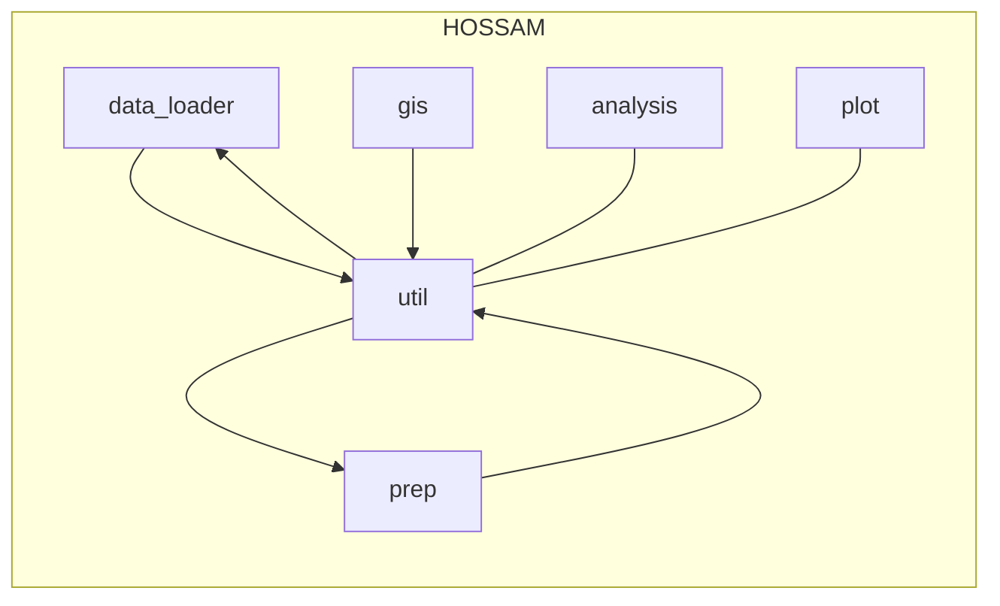

# 모듈 아키텍처

아래 다이어그램은 `hossam` 패키지의 주요 모듈 간 의존 관계를 나타냅니다.

설명:
- `util` ↔ `data_loader`: 상호 참조 관계 (표 출력/데이터 로딩)
- `util` → `prep`: 카테고리 설정 유틸 사용
- `gis`, `prep` → `util`: 테이블 출력 유틸 사용
- `analysis`, `plot`: 주로 외부 라이브러리 의존, 공용 유틸과 느슨한 결합

> 참고: 상호 의존(양방향)은 초기화/실행 타이밍에 주의가 필요합니다.
